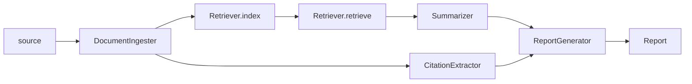

# research-agent

An AI-assisted research workflow library for literature ingestion, retrieval, summarization, citation extraction, and report generation.

## What this library is

research-agent provides a dependency-injection pipeline where each stage is swappable.
The default implementations are placeholders so the package is safe to run out of the box while giving you clear extension points.

| Pipeline stage | Interface | Default implementation | Default behavior |
|---|---|---|---|
| Document ingestion | `DocumentIngester` | `PlaceholderIngester` | Returns no documents |
| Retrieval / indexing | `Retriever` | `PlaceholderRetriever` | Stores indexed docs in memory, retrieves no chunks |
| Summarization | `Summarizer` | `PlaceholderSummarizer` | Returns empty summary content |
| Citation extraction | `CitationExtractor` | `PlaceholderCitationExtractor` | Returns no citations |
| Report generation | `ReportGenerator` | `PlaceholderReportGenerator` | Uses query as title; falls back to `(no summary available)` body |

## Pipeline flow

The `Container.run(...)` orchestration performs these steps:

1. Ingest documents from a source.
2. Index documents in the retriever.
3. Retrieve top-k chunks for the query.
4. Summarize retrieved chunks.
5. Extract citations from each ingested document.
6. Generate and return a report.



## Installation

This project targets Python 3.12+.

```bash
pip install -e .
```

For development dependencies:

```bash
uv sync --extra dev
```

## Quickstart

Run with all default placeholder components:

```python
from research_agent.container import Container

container = Container()
report = container.run(source="papers/", query="transformer architectures")

print(report.title)  # "transformer architectures"
print(report.body)   # "(no summary available)"
print(report.citations)  # []
```

Inject your own components:

```python
from research_agent.container import Container
from my_package import MyIngester, MyRetriever, MySummarizer

container = Container(
		ingester=MyIngester(),
		retriever=MyRetriever(),
		summarizer=MySummarizer(),
)

report = container.run(
		source="s3://my-bucket/papers/",
		query="attention mechanisms in long-context models",
		top_k=20,
)
```

## Interfaces and data contracts

Core value objects are immutable dataclasses:

- `Document`
- `Chunk`
- `Citation`
- `Summary`
- `Report`

Core extension interfaces (ABCs):

- `DocumentIngester`
- `Retriever`
- `Summarizer`
- `CitationExtractor`
- `ReportGenerator`

See `src/research_agent/interfaces.py` for full signatures.

## Project layout

```text
src/research_agent/
	interfaces.py            # contracts and value objects
	container.py             # DI container and orchestration entrypoint
	ingestion/               # DocumentIngester implementations
	retrieval/               # Retriever implementations
	summarization/           # Summarizer implementations
	citation/                # CitationExtractor implementations
	report/                  # ReportGenerator implementations

tests/
	test_interfaces.py       # value object behavior and immutability
	test_placeholders.py     # placeholder component behavior
	test_container.py        # orchestration and constructor injection
```

## Development

```bash
# Install uv once
pip install uv

# Sync runtime + dev dependencies
uv sync --extra dev

# Lint
uv run ruff check src/ tests/

# Format
uv run ruff format src/ tests/

# Type check
uv run pyright src/

# Test
uv run pytest tests/ -v
```

### Pre-commit hooks

```bash
uv run pre-commit install
uv run pre-commit run --all-files
```

## CI

GitHub Actions runs linting, type checking, and tests on pushes and pull requests targeting main. See [.github/workflows/ci.yml](.github/workflows/ci.yml).
